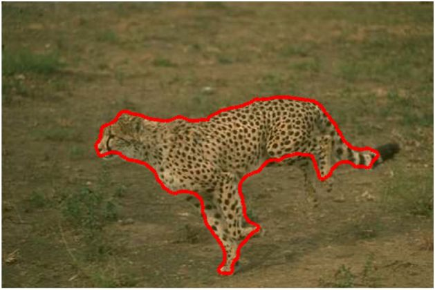
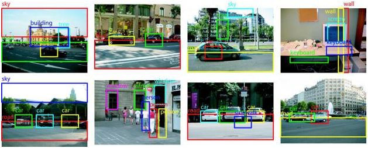

# Quick introduction to Computer Vision
### What is Computer Vision?
Computer Vision is a field in Computer Science that focuses on giving computers the ability to see the visual world like the human eye does. The computers achieve this through acquiring, processing and analyzing the digital images and videos with the aim to extract meaningful information from the visual world. 
### A brief history of Computer Vision
The journey of Computer Vision started in the 1960s with the idea of giving computers the ability to mimic human vision and then ask them what they see. In 1966 the first milestone in the journey of artificially intelligent Computer Vision was reached when a camera was attached to a computer and then the computer was asked to describe what it saw.

In 1970 the foundations of the computer algorithms that exist today were formed which could extract edges from images, labeling of lines, motion estimation and optical flow. 
In the 1990s the researchers of Computer Vision focused mainly on mathematical analysis and quantitative aspects and they developed algorithms that were based on statistical learning which were later used for face recognition. 

In the decade that followed researchers of Computer Vision stated tapping into feature based techniques which are being used in conjunction with machine learning techniques and optimization techniques which are more complex. 

Currently the continuous improvements in deep learning techniques are facilitating the progress of Computer Vision and the accuracy of the algorithms that are now being used on Computer Vision datasets has proved to be much better.  
### Fields of Computer Vision
#### Object Detection
In this field the machines are supposed to  detect objects using the pattern of geometry for example detecting faces, detecting bodies or animals. There are many algorithms that are used to detect objects by computers for example the binary matrix is used to see where an object starts and where it ends on the binary image. This is achieved by finding connected components which are then used to determine the boundaries of the object. The computers will then generate a pixelated boundary of any color to show the location of that object. Below is an image showing a cheetahs that has been identified and a red boundary has been drawn around it.

#### Object Recognition
This field follows the same steps taken in object detection but the only difference is that the object will be detected already and now the computer has got to compare the results with what is already stored in the database. For example when a semi-autonomous vehicle is trained to detect a road sign that signals road users to stop, the next time is detects a road sign it will then check if the sign matches the stop sign already stored in its database. If the sign matches with stop sign stored in the database then it will regcognize it. The image below shows objects that are detected and recognized by the computer:

#### Object Tracking

